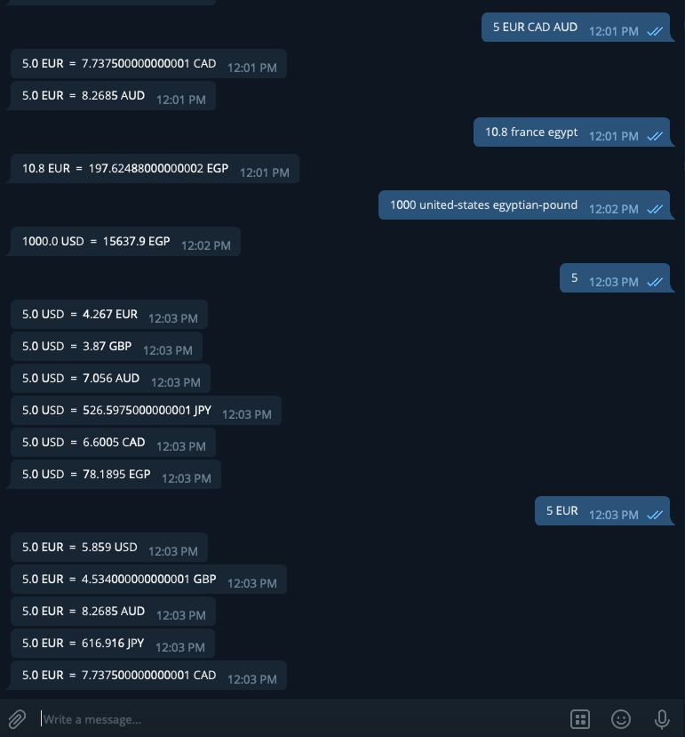

# Currency Converter telegram-bot

## screenshoot

## Built With

- Ruby 2.6
- exchangerate-api
- Telegram Bot API

## prerequisites requirements:
 
 - ruby 
 - Telegram Bot API 

## setup:

 - clone https://github.com/elasfarc/telegram-bot.git cd telegram-bot
 - gem install telegram-bot-ruby (Telegram Bot API ) 
 - ruby bin/main.rb.   (in the root file of the project)
 - after running go to telegram channel (@currency_converterr_bot)

## Bot Input-Interpret

	 -Provide your pair in the form of the following:
  	 		[Amount] [currencies pairs] 
  	 			[currencies pairs] = (base currency) (one or more quote currencies)

  	  -all arguments are optional
  	   		if no [amount] is  provided default amount is 1.0 
  	   				USD EUR --> 1 USD against EUR
  	   		if no [currencies pairs] are provided 
  	   				USD --> (base currency) 
  	   				 EUR GBP AUD JPY CAD EGP --> (quote currencies)
  	   		if  [currencies pairs] is provided with only one value [v]
  	   				v --> (base currency) 
  	   				USD EUR GBP AUD JPY CAD EGP --> (quote currencies)
  	   						*if [v] ∈ (quote currencies) [v] is NOT shown against itself
  	   		
  	   		if [currencies pairs] is provided with more than one value [ [v1] [v2] [v3] .....]		
  	   				[v1] --> (base currency) 
  	   				[v2],[v3]..... -->  (quote currencies)
  	   				
  	   	- each [v] ∈ [currencies pairs] could be in the form of  currency code, country name or currency name
  	   			12 USD France CAD	--> 12 USD againist EUR, 12 USD againist CAD
  	   			*  country name or currency name must be dash (-) spearated if its consists of more than one word
  	   					 ex) united-states or egyptian-pound
  	   	
  	   	- more than one [amount] values are not allowed 
  	   			 the program will ask the user to check the input 		
  	   			 ex) '144 12 USD EUR'		 
  	   	- more than one space is allowed
  	   			ex)  '      5 USD     EUR' --> '5 USD EUR'
  	   			
  	   	- space is not required between [amount] and  v1 ∈ [currencies pairs] but it's required between v1,v2... 
  	   			ex) '12USD EUR'         (ALLOWED)
  	   			ex) '12USDEUR'          (NOT ALLOWED)    --------------> case 2 
  	   			ex) '12USDEUR EGP'  (NOT ALLOWED)   --------------> case 3 with base EGP
  	   			
 		- program will ignore any v ∈[currencies pairs] that it can't interpret
 				ex) '1000 USD EGP 15 EUR' ---> '1000 USD EGP EUR'
				ex) '12USDEUR EGP' -------------> '12 EGP'

## Testing Instructions
- Tested with RSpec 3.9 
- For testing Run 'rspec' in the terminal from inside the program folder.
## Install
- https://relishapp.com/rspec/rspec-rails/docs/gettingstarted

## Authors

👤 **Mohammed Al-Asfar**

- [Github](https://github.com/elasfarc)

## 🤝 Contributing

Contributions, issues, and feature requests are welcome!

Feel free to check the [issues page](https://github.com/elasfarc/telegram-bot/issues).

## Show your support

Give a ⭐️ if you like this project!

## 📝 License

This project is [MIT](https://mit-license.org/) licensed.
